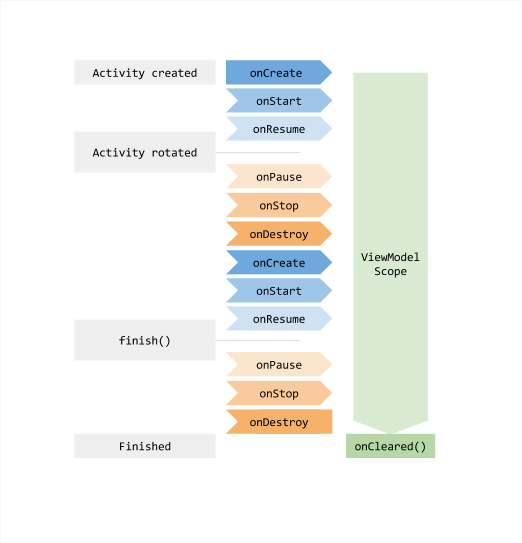

# Android MVVM Example

This project is test example of the article 'Guide to app architecture'.  
[Guide to app architecture  \|  Android Developers](https://developer.android.com/jetpack/guide)

##  Android Activity Lifecycles

- Launch

```
D/MainActivity: onCreate state:INITIALIZED
D/MainActivity: onStart state:CREATED
D/MainActivity: onResume state:STARTED
D/MainActivity: onPostResume state:RESUMED
```

- rotate device

```
D/MainActivity: onPause state:STARTED
D/MainActivity: onStop state:CREATED
D/MainActivity: onDestroy state:DESTROYED
D/MainActivity: onCreate state:INITIALIZED
D/MainActivity: onStart state:CREATED
D/MainActivity: onResume state:STARTED
D/MainActivity: onPostResume state:RESUMED
```

[ViewModel の概要  \|  Android デベロッパー  \|  Android Developers](https://developer.android.com/topic/libraries/architecture/viewmodel?hl=ja)



> Figure 1 illustrates the various lifecycle states of an activity as it undergoes a rotation and then is finished\. The illustration also shows the lifetime of the ViewModel next to the associated activity lifecycle\. This particular diagram illustrates the states of an activity\. The same basic states apply to the lifecycle of a fragment\. 
> [ViewModel Overview  |  Android Developers](https://developer.android.com/topic/libraries/architecture/viewmodel?hl=en) 
> [https://developer.android.com/topic/libraries/architecture/viewmodel?hl=en](https://developer.android.com/topic/libraries/architecture/viewmodel?hl=ens) 


# Fragment KTX

Android KTX  |  Android デベロッパー  |  Android Developers https://developer.android.com/kotlin/ktx?hl=ja#fragment

```
// Get a reference to the ViewModel scoped to this Fragment
val viewModel by viewModels<MyViewModel>()

// Get a reference to the ViewModel scoped to its Activity
val viewModel by activityViewModels<MyViewModel>()
```

```
Cannot inline bytecode built with JVM target 1.8 into bytecode that is being built with JVM target 1.6. Please specify proper '-jvm-target' option
```

- build.gradle(Module: app)

```
kotlinOptions {
  jvmTarget = '1.8'
}

```

# References

- [Android Architecture Components  \|  Android Developers](https://developer.android.com/topic/libraries/architecture)


